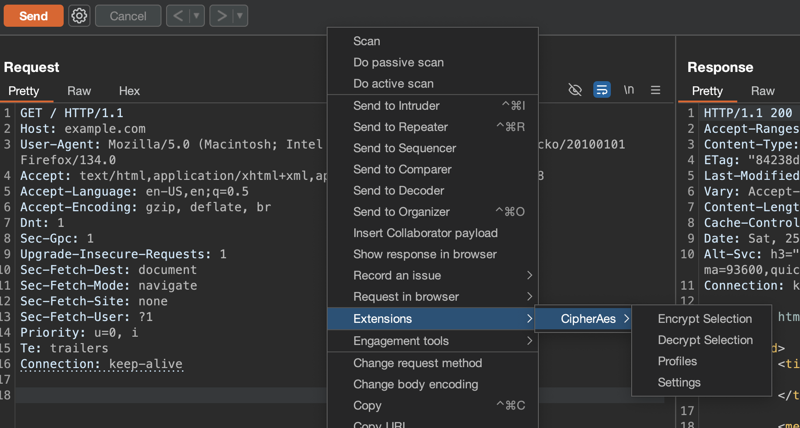
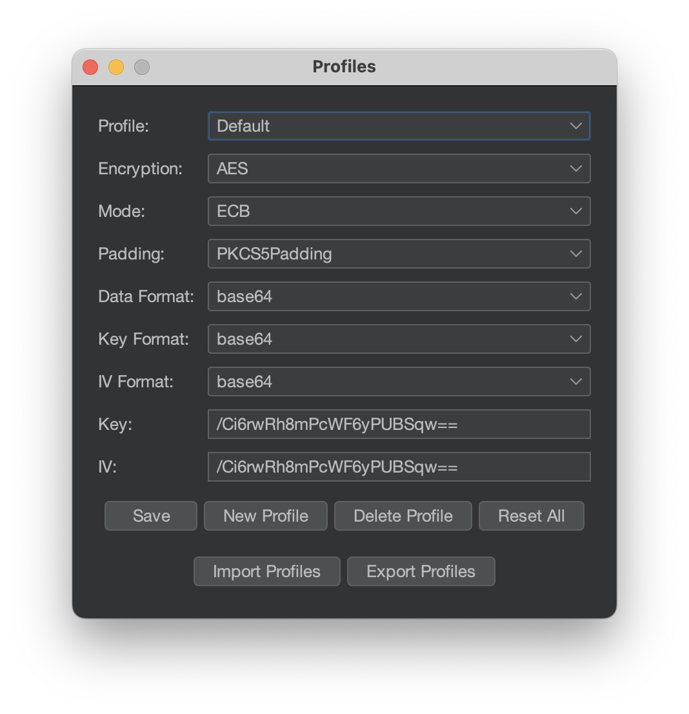
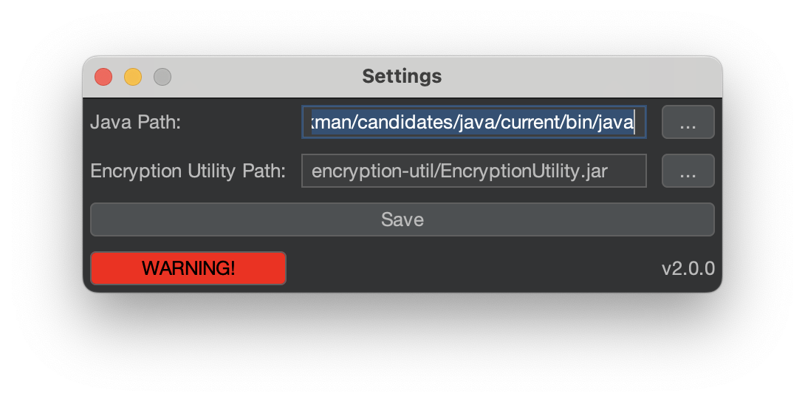

# CipherAes

**CipherAes** is a powerful Burp Suite extension that provides seamless encryption and decryption in just a few clicks, similar to Burp Suite's "Convert Selection" functionality. It allows users to effortlessly process selected text from HTTP requests and responses using various encryption algorithms.

## Features

- **Encryption Algorithms**: AES, DES, DESede, Blowfish, RC2.
- **Modes**: ECB, CBC, CFB, OFB, GCM.
- **Padding Options**: NoPadding, PKCS5Padding, PKCS7Padding.
- **Data Formats**: Base64 and Hex.
- **Key and IV Formats**: Base64, Hex, Plaintext, None.
- **Profile Management**: Create, Add, and manage multiple encryption profiles.

## Installation

1. Compile Encryption Utility

    **Note:** java version "23.0.1"

    1. Download BouncyCastle JAR: Get the `bcprov-jdk18on-1.78.1.jar` from the [BouncyCastle website](https://www.bouncycastle.org/download/bouncy-castle-java/).
    2. Compile: `javac -cp .:bcprov-jdk18on-1.78.1.jar EncryptionUtility.java`
    3. Package: `jar cvfm EncryptionUtility.jar MANIFEST.MF EncryptionUtility.class bcprov-jdk18on-1.78.1.jar`

    Or, use pre-compiled jar binary.

2. Or, Download latest version from the releses.
3. Load extension in the Burp Suite from Extensions --> Add --> Extension type:python --> Selete "CipherAes.py" from FS --> Next --> Done
4. **Optional:** Set `java` and `EncryptionUtility.jar` PATHs, if not found in default location.

**Note:** Default file structure.
```
.
├── CipherAes.py
└── encryption-util
    ├── EncryptionUtility.jar
    └── bcprov-jdk18on-1.78.1.jar
```

## Usage

1. Configure your encryption settings using the Profiles tab.
2. Select the text you want to encrypt or decrypt within an HTTP request or response.
3. Right-click and choose the desired operation from the CipherAes context menu.

**Extra:** Extended usage of `EncryptionUtility.jar` from the command line can be found [here](encryption-util/USAGE.md) 

## Screenshots





## Contact

For support or inquiries, please open an issue on GitHub.

---

*Enhance your offensive cybersecurity arsenal with CipherAes!*